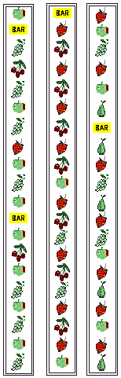

## Fruit Machines
#### Rules
A fruit machine with 3 dials and 20 symbols (not all different) on each dial is illustratred opposite. Each dial can stop on any one of its 20 symbols, and each of the 20 symbols on each dial is equally likely to occur. The machine costs 10p a go. The three symbols highlighted determine how much, if anything, is won.

| Symbol          | Quantity | Payout |
|-----------------|:--------:|-------:|
| Bar             |    3     |    £40 |
| Bar             |    2     |    £20 |
| Strawberries 🍓 |    3     |     £5 |
| Grapes 🍇       |    3     |     £5 |
| Apples 🍏       |    3     |     £5 |
| Cherries 🍒     |    2     |     £5 |

